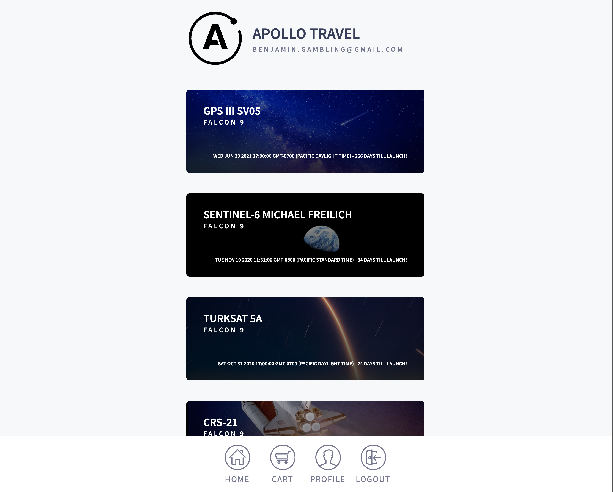

# Apollo Travel

This project was a adaptation of the Apollo Full Stack Tutorial, i slightly diverted on my own path to use Prisma and the database i was comfortable with so i could concentrate on learning apollo and create a rich and interactive React web app using typescript. I called the app Apollo Travel as it was heavily focused on using apollo in the front and back end. It using the Space X API to call all upcoming and past launches and by logging in with your email address you are able to browse and book onto future launches with the idea that in the near future websites like this will exist when space travel becomes more accessible.

# 

# 

## Table of contents

1. [Demo](#demo)
2. [Technologies](#technologies)
3. [Features](#features)
4. [Development](#development)
5. [License](#license)

## Demo

Here is the working live demo:
[https://apollo-travel.herokuapp.com/](https://apollo-travel.herokuapp.com/).

## Technologies

Client

- ReactJS
- Apollo
- React Emotion
- GraphQL

Server

- Node.js
- Express.js
- Prisma
- Apollo Server

## Features

- GraphQl query's and mutations
- Space X REST API
- PostgreSQL w/ Prisma
- Minimizes data sent to user
- Log In (Email only)
- Browse all launches (Upcoming + Past)
- Add to cart and view cart
- Only able to book/cancel future launches
- See your profile and trips booked

### Development

- Provide more information about launches (Upcoming + Past)
- Better authentication
- Inventory on Ships
- Payment System

## License

> You can check out the full license [here](LICENSE)

This project is licensed under the terms of the **MIT** license.
